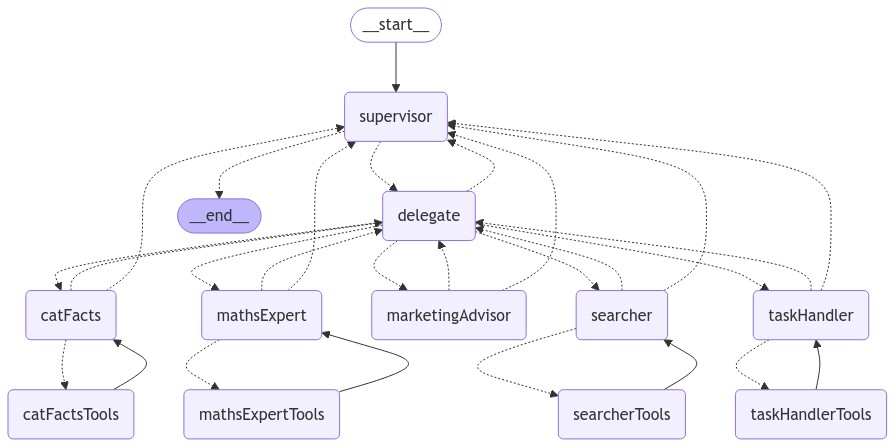

# Example Langchain Chatbot

This is an example chatbot written in Typescript using Langchain / LangGraph.
Use this as base for completing the task below.

## Agent Architecture

## Demo

<video width="80%" controls>
  <source src="./assets/execify_interview_demo.mp4" type="video/mp4">
  Your browser does not support the video tag.
</video>

## Todo

[x] Add a **taskHandler** agent that can manage tasks in an SQLite database with the following functionality:
  - Add a new task (addTask: Add a task with a description)
  - List all tasks (listTasks: Retrieve all tasks with their IDs, descriptions, completion status, and notes)
  - Remove a task (removeTask: Delete a task by ID)
  - Add notes to tasks (addNote: Add a note to a specific task by ID)
  - Update a task description (updateTaskDescription: Update the description of a specific task by ID)
  - Complete a task (completeTask: Mark a task as completed by ID)

[ ] Represent that task table as a markdown table in the chatbot ui
  - Only display the task list when the user asks for it

[ ] Implement a vector store
  - Perhaps a file backed knowledge store (Such as PDFs)
  
[ ] Add context sharing between agents as "memories" rather than messages, this may help with improved reliability.

[ ] Add semantic caching (of what?)

### Guide

- Tasks should be retrievable between invocations of the chatbot
  - Store the tasks however you wish, either in a database or on file.
- Feel free to change any part of the application / code where required
- Build the best prompts you can
- Make chatbot as reliable as possible
- You will likely need to change existing agents / nodes / edges. You can change any part of this project so if you think something can be done better, change it!
- The existing prompts are very minimal, expand on them as much as possible.

## Extra Credits

Nothing in this section is required, your time is limited and we understand that!

However, we want you to prove as strongly as possible that you are a skilled AI expert.
Feel free to expand on this project as much as possible. 
Here are some things you could attempt (if it makes sense to) if you want to go the extra mile:

